# 1040 + Schedule C + Schedule SE 数据解析逻辑与识别方案（2025 税年）

## 文档目的

本文是 `fee_task` 的交付物，目标是把 `Form 1040`、`Schedule C`、`Schedule SE` 三张表在创作者/自雇场景下的数据来源、跨表流转、解析流程和票据识别方案梳理成后续实现蓝图。

本文只做文档分析，不变更任何代码、schema 或 storage contract。

## 范围与边界

- 包含：`Form 1040` 主表中与自雇创作者直接相关的关键行、`Schedule C`、`Schedule SE`、`1099-NEC` 到 `Schedule C` 的关键映射、模板获取与解析流程、用户上传票据的类型识别与合规校验。
- 不包含：`W-2` 完整建模、`Schedule A / D / E / F` 等其他附表的实现细节、OCR 引擎最终选型、后端 API 设计、schema 变更、任何生产代码实现。

## 参考依据

### IRS 2025 官方表单 / instructions

- `Form 1040 (2025)`
- `Schedule 1 (Form 1040) (2025)`
- `Schedule 2 (Form 1040) (2025)`
- `Schedule C (Form 1040) (2025)` instructions：`i1040sc`
- `Schedule SE (Form 1040) (2025)` instructions：`i1040sse`
- `Form 1040` instructions：`i1040gi`

### 仓库内已有实现

- `apps/mobile/src/features/form-schedule-c/schedule-c-layout.2025.json`
- `apps/mobile/src/features/form-schedule-c/form-schedule-c-model.ts`
- `apps/mobile/src/features/form-schedule-c/use-form-schedule-c.native.ts`
- `apps/mobile/tests/form-schedule-c-model.test.ts`
- `apps/mobile/src/features/form-1099-nec/form-1099-nec-layout.2025.json`
- `apps/mobile/src/features/form-1099-nec/form-1099-nec-model.ts`
- `apps/mobile/src/features/form-1099-nec/use-form-1099-nec.native.ts`
- `apps/mobile/tests/form-1099-nec-model.test.ts`

## 结论先行

### 1. 是否需要先从 IRS 官网获取模板，再解析用户上传票据

需要，但应该拆成两个不同阶段：

1. 年度模板注册：每个税年先从 IRS 官方 blank form / instructions 获取模板，生成 `layout JSON + slot registry + calculation rules`。
2. 用户票据解析：用户上传 PDF / 图片时，不再实时请求 IRS，而是直接匹配本地已注册的税年模板进行识别、抽取和校验。

也就是说，正确答案不是“每上传一张票据都先去官网拉模板”，而是“每个税年先做一次模板基建，运行时用本地版本化模板解析用户票据”。

### 2. 当前仓库已经完成到哪一步

- `Schedule C`：`Phase 1 模板获取` 与 `Phase 2 字段注册` 基本完成，已经有 2025 layout JSON、slot model、snapshot builder 和自动化测试。
- `1099-NEC`：同样已经完成 `Phase 1–2` 的最小闭环。
- `Form 1040 / Schedule 1 / Schedule 2 / Schedule SE`：尚未建立对应的 layout JSON、slot model、snapshot builder、cross-form validator。

### 3. 当前 `Schedule C` 模型的真实覆盖情况

- 已有 2025 年双页表单 slot 建模。
- 已有 10 个公式行标记为 `calculated`。
- 只有 2 个 slot 目前能直接从本地 DB 自动带值：
  - `proprietorName`
  - `line1GrossReceiptsOrSales`
- 其余绝大多数仍是 `manual`，说明现阶段更像“官方版式预览 + 局部自动回填”，不是可申报级的税表生成器。

### 4. 推荐的后续实现顺序

1. 先补 `Form 1040 / Schedule 1 / Schedule 2 / Schedule SE` 的模板和 slot registry。
2. 再做文档分类与抽取层。
3. 最后做跨表验证与缺失项提示。

如果顺序反过来，上传票据即使抽到了数，也没有稳定的字段注册表和跨表校验规则可以落地。

## 当前仓库基线盘点

| 工件 | 当前状态 | 作用 |
|---|---|---|
| `schedule-c-layout.2025.json` | 已存在 | 2025 `Schedule C` 官方 PDF 版式解析结果 |
| `form-schedule-c-model.ts` | 已存在 | 定义 slot id、类型、说明、source 分类、公式行 |
| `use-form-schedule-c.native.ts` | 已存在 | 从 SQLite 聚合 `proprietorName` 与 `grossReceiptsCents` |
| `form-schedule-c-model.test.ts` | 已存在 | 验证 `database / calculated / manual` 分类 |
| `form-1099-nec-layout.2025.json` | 已存在 | 2025 `1099-NEC` 版式解析结果 |
| `form-1099-nec-model.ts` | 已存在 | 定义 `1099-NEC` slot 与 DB 回填逻辑 |
| `use-form-1099-nec.native.ts` | 已存在 | 从 SQLite 聚合 payer/recipient/box1/box4 预览值 |
| `Form 1040 / Schedule 1 / Schedule 2 / Schedule SE` 对应工件 | 缺失 | 需要后续新增 |

### 当前 DB 能直接供税表预览使用的字段

| 表单 | 当前自动回填字段 | 当前来源 |
|---|---|---|
| `Schedule C` | `proprietorName` | `entities.legal_name` |
| `Schedule C` | `line1GrossReceiptsOrSales` | `records` 中 `posted / reconciled` 且 `record_kind in ('income', 'invoice_payment', 'platform_payout')` 的 `gross_amount_cents` 汇总 |
| `1099-NEC` | `payerName` | `entities.legal_name` |
| `1099-NEC` | `recipientName` | `counterparties.legal_name` |
| `1099-NEC` | `box1` | 选中 counterparty 关联记录的 `gross_amount_cents` 汇总 |
| `1099-NEC` | `box4` | 选中 counterparty 关联记录的 `withholding_amount_cents` 汇总 |

## 三表数据流总览

```mermaid
flowchart LR
  A["1099-NEC Box 1\nNonemployee compensation"] --> B["Schedule C Line 1\nGross receipts or sales"]
  B --> C["Schedule C Line 3\nLine 1 - Line 2"]
  C --> D["Schedule C Line 5\nLine 3 - Line 4"]
  D --> E["Schedule C Line 7\nGross income"]
  E --> F["Schedule C Line 29\nLine 7 - Line 28"]
  F --> G["Schedule C Line 31\nNet profit or loss"]

  G --> H["Schedule 1 Line 3\nBusiness income or loss"]
  H --> I["Schedule 1 Line 10\nAdditional income total"]
  I --> J["Form 1040 Line 8\nAdditional income"]
  J --> K["Form 1040 Line 9\nTotal income"]
  K --> L["Form 1040 Line 11a/11b\nAGI chain"]

  G --> M["Schedule SE Line 2\nNet profit or loss from Schedule C"]
  M --> N["Schedule SE Line 3-12\nSE tax computation"]
  N --> O["Schedule 2 Line 4\nSelf-employment tax"]
  O --> P["Schedule 2 Line 21\nTotal other taxes"]
  P --> Q["Form 1040 Line 23\nOther taxes"]
  Q --> R["Form 1040 Line 24\nTotal tax"]

  N --> S["Schedule SE Line 13\nDeductible half of SE tax"]
  S --> T["Schedule 1 Line 15\nDeductible part of SE tax"]
  T --> U["Schedule 1 Line 26\nAdjustments to income"]
  U --> V["Form 1040 Line 10\nAdjustments to income"]
  V --> L

  W["1099-NEC Box 4\nFederal income tax withheld"] --> X["Form 1040 Line 25b\nFederal income tax withheld from Form(s) 1099"]
  X --> Y["Form 1040 Line 33\nTotal payments"]
  R --> Z["Form 1040 Line 34 / 37\nRefund or amount owed"]
  Y --> Z
```



## Form 1040 主表关键行梳理

这里把“主表”按真正影响自雇创作者申报结果的链路展开。由于 `Schedule C` 和 `Schedule SE` 不直接写入 `Form 1040` 的所有位置，中间还要经过 `Schedule 1` 和 `Schedule 2`，因此主表解析设计必须把这些 carry lines 一起纳入。

| 表单 | 行 | 含义 | 数据来源类型 | 上游来源 | 说明 |
|---|---|---|---|---|---|
| `Schedule 1` | Line 3 | `Business income or (loss)` | carry / calculated | `Schedule C line 31` | 自雇经营净利润或净亏损先落这里 |
| `Schedule 1` | Line 10 | `Additional income` total | calculated | `Schedule 1 lines 1-7, 9` | 最终带到 `Form 1040 line 8` |
| `Form 1040` | Line 8 | `Additional income from Schedule 1, line 10` | carry | `Schedule 1 line 10` | 自雇经营结果进入主表的入口 |
| `Form 1040` | Line 9 | `Total income` | calculated | `1z + 2b + 3b + 4b + 5b + 6b + 7a + 8` | 自雇收入和其他收入一起汇总 |
| `Schedule 1` | Line 15 | `Deductible part of self-employment tax` | carry / calculated | `Schedule SE line 13` | SE tax 的一半作为 above-the-line deduction |
| `Schedule 1` | Line 26 | `Adjustments to income` total | calculated | `Schedule 1 lines 11-23, 25` | 带到 `Form 1040 line 10` |
| `Form 1040` | Line 10 | `Adjustments to income from Schedule 1, line 26` | carry | `Schedule 1 line 26` | 直接影响 AGI |
| `Form 1040` | Line 11a / 11b | `Adjusted gross income` | calculated | `line 9 - line 10` | 自雇税扣除会在这里体现 |
| `Form 1040` | Line 13a | `Qualified business income deduction` | external / manual / calculated | `Form 8995 or 8995-A` | 与 `Schedule C` 强相关，但不在本 feat 实现范围内 |
| `Form 1040` | Line 15 | `Taxable income` | calculated | `line 11b - line 14` | 受 `Schedule C` 利润和 `Schedule SE` 扣除共同影响 |
| `Schedule 2` | Line 4 | `Self-employment tax` | carry / calculated | `Schedule SE line 12` | `Schedule SE` 的税额不直接写主表，先写这里 |
| `Schedule 2` | Line 21 | `Total other taxes` | calculated | `Schedule 2 lines 4, 7-16, 18, 19` | 再带回主表 `line 23` |
| `Form 1040` | Line 23 | `Other taxes, including self-employment tax` | carry | `Schedule 2 line 21` | 主表体现 SE tax 的位置 |
| `Form 1040` | Line 24 | `Total tax` | calculated | `line 22 + line 23` | 最终税额汇总 |
| `Form 1040` | Line 25b | `Federal income tax withheld from Form(s) 1099` | manual / extracted / future database | `1099 box 4` | 若有 backup withholding，要在此体现 |
| `Form 1040` | Line 26 | `Estimated tax payments` | manual | 用户季度预缴 | 与经营活动强相关，但当前仓库无存储支持 |
| `Form 1040` | Line 33 | `Total payments` | calculated | `25d + 26 + 32` | 与是否退税/补税直接相关 |
| `Form 1040` | Line 34 | `Overpayment` | calculated | `line 33 - line 24` | 退税结果 |
| `Form 1040` | Line 37 | `Amount you owe` | calculated | `line 24 - line 33` | 补税结果 |

### 主表视角下的数据来源分类

- `manual`
  - 纳税人身份信息、报税身份、`line 26` 预缴税、`line 25b` 中来自外部 1099 的 withholding。
- `carry`
  - `Form 1040 line 8`、`line 10`、`line 23`、`Schedule 1 line 3`、`line 15`、`Schedule 2 line 4`。
- `calculated`
  - `line 9`、`line 11a/11b`、`line 15`、`line 24`、`line 33`、`line 34`、`line 37`。
- `external`
  - `line 13a QBI deduction` 来自 `Form 8995 / 8995-A`，应明确标注为本阶段依赖但不纳入本模型。

## Schedule C 数据来源分类与当前覆盖

### 当前 `Schedule C` 模型结论

- 当前仓库已经建了完整的 2025 双页 slot model。
- 现有 model 更偏“字段注册与版式覆盖”，不是“可自动成表”。
- 现有 source 分布可以概括为：
  - `database`：2 个 slot
  - `calculated`：10 个 slot
  - `manual`：其余 slot

### 当前已经自动回填的 slot

| slot / 行 | source | 当前回填方式 |
|---|---|---|
| `proprietorName` | `database` | `entities.legal_name` |
| `line1GrossReceiptsOrSales` | `database` | `records.gross_amount_cents` 汇总 |

### 当前已经公式化的 slot

| 行 | slot id | 当前规则 |
|---|---|---|
| Line 3 | `line3Subtract2` | `line1 - line2` |
| Line 5 | `line5GrossProfit` | `line3 - line4` |
| Line 7 | `line7GrossIncome` | `line5 + line6` |
| Line 27b | `line27bTotalOtherExpenses` | `Part V` 汇总 |
| Line 28 | `line28TotalExpenses` | `lines 8-27a` 求和 |
| Line 29 | `line29TentativeProfitLoss` | `line7 - line28` |
| Line 31 | `line31NetProfitLoss` | `line29 - line30` |
| Line 40 | `line40AddLines35To39` | `lines 35-39` 求和 |
| Line 42 | `line42CostOfGoodsSold` | `line40 - line41` |
| Line 48 | `line48TotalOtherExpenses` | `Part V row` 求和 |

### Part 0：身份与控制字段

| 行 / 字段 | 当前 source 分类 | 当前覆盖情况 | 缺口 |
|---|---|---|---|
| Name of proprietor | `database` / `manual` | 已覆盖 | 只取第一条 `entity`，还不支持多业务主体 |
| SSN | `manual` | 已建 slot | 本地 schema 不存完整 SSN |
| Line A principal business activity | `manual` | 已建 slot | 还没有业务分类字典 / NAICS 映射 |
| Line B business code | `manual` | 已建 slot | 还没有自动 PBA code 推断 |
| Line C business name | `manual` | 已建 slot | 没有业务层级实体建模 |
| Line D EIN | `manual` | 已建 slot | schema 不存完整 EIN |
| Line E address / city / ZIP | `manual` | 已建 slot | schema 不存业务地址 |
| Line F accounting method | `manual` | 已建 slot | schema 不存会计方法 |
| Line G material participation | `manual` | 已建 slot | schema 不存该控制字段 |
| Line H started/acquired in 2025 | `manual` | 已建 slot | schema 不存业务成立/收购事件 |
| Line I required to file 1099 | `manual` | 已建 slot | 可从付款记录推断，但当前未实现 |
| Line J filed required 1099 | `manual` | 已建 slot | 当前没有 filing status 数据 |

### Part I：Income

| 行 | 含义 | 当前 source 分类 | 当前覆盖情况 | 缺口 |
|---|---|---|---|---|
| Line 1 | Gross receipts or sales | `database` / `manual` | 已自动汇总收入记录 | 尚未显式接入 `1099-NEC box1`、`1099-K`、多业务拆分 |
| Line 1 checkbox | Statutory employee | `manual` | 已建 slot | 缺少 W-2 statutory employee 分流逻辑 |
| Line 2 | Returns and allowances | `manual` | 已建 slot | 没有退款/allowance 到税表行的自动映射 |
| Line 3 | Line 1 - Line 2 | `calculated` | 已建公式 | 依赖 line 2 录入正确 |
| Line 4 | Cost of goods sold | `manual` | 已建 slot | 还未自动连接 Part III line 42 |
| Line 5 | Gross profit | `calculated` | 已建公式 | 无 |
| Line 6 | Other income | `manual` | 已建 slot | 没有其他营业收入的规则映射 |
| Line 7 | Gross income | `calculated` | 已建公式 | 无 |

### Part II：Expenses

| 行 | 含义 | 当前 source 分类 | 当前覆盖情况 | 缺口 |
|---|---|---|---|---|
| Line 8 | Advertising | `manual` | 已建 slot | 没有 expense category 到税行映射 |
| Line 9 | Car and truck expenses | `manual` | 已建 slot | 缺 mileage / actual expense 分支 |
| Line 10 | Commissions and fees | `manual` | 已建 slot | 无自动归类 |
| Line 11 | Contract labor | `manual` | 已建 slot | 无 1099 payer-side 支出聚合 |
| Line 12 | Depletion | `manual` | 已建 slot | 当前产品场景通常不适用，但 slot 已有 |
| Line 13 | Depreciation / section 179 | `manual` | 已建 slot | 依赖 `Form 4562`，当前无建模 |
| Line 14 | Employee benefit programs | `manual` | 已建 slot | 无 payroll / benefit 数据 |
| Line 15 | Insurance (other than health) | `manual` | 已建 slot | 无自动归类 |
| Line 16a | Mortgage interest | `manual` | 已建 slot | 无贷款/房产数据 |
| Line 16b | Other interest | `manual` | 已建 slot | 无自动归类 |
| Line 17 | Legal and professional services | `manual` | 已建 slot | 无自动归类 |
| Line 18 | Office expense | `manual` | 已建 slot | 无自动归类 |
| Line 19 | Pension and profit-sharing plans | `manual` | 已建 slot | 无 retirement plan 数据 |
| Line 20a | Rent or lease - vehicles/equipment | `manual` | 已建 slot | 无租赁拆分 |
| Line 20b | Rent or lease - other business property | `manual` | 已建 slot | 无租赁拆分 |
| Line 21 | Repairs and maintenance | `manual` | 已建 slot | 无自动归类 |
| Line 22 | Supplies | `manual` | 已建 slot | 无自动归类 |
| Line 23 | Taxes and licenses | `manual` | 已建 slot | 无税费/牌照自动归类 |
| Line 24a | Travel | `manual` | 已建 slot | 无差旅规则 |
| Line 24b | Meals | `manual` | 已建 slot | 缺 50% / 特殊年份扣除限制处理 |
| Line 25 | Utilities | `manual` | 已建 slot | 无自动归类 |
| Line 26 | Wages | `manual` | 已建 slot | 当前无 payroll |
| Line 27a | Other expenses | `manual` | 已建 slot | 2025 版本已反映该行存在 |
| Line 27b | Total other expenses from Part V | `calculated` | 已建公式 | 依赖 Part V 明细 |
| Line 28 | Total expenses | `calculated` | 已建公式 | 依赖 8-27a 输入 |
| Line 29 | Tentative profit or loss | `calculated` | 已建公式 | 无 |
| Line 30a | Home office total square footage | `manual` | 已建 slot | 缺 home office 证明字段 |
| Line 30b | Home office business square footage | `manual` | 已建 slot | 缺 home office 证明字段 |
| Line 30 | Expenses for business use of home | `manual` | 已建 slot | 需 `Form 8829` 或 simplified method 计算 |
| Line 31 | Net profit or loss | `calculated` | 已建公式 | 还未真正回流到 `Schedule 1 / SE` 模型 |
| Line 32a | All investment at risk | `manual` | 已建 slot | 无 at-risk 规则 |
| Line 32b | Some investment not at risk | `manual` | 已建 slot | 无 at-risk 规则 |

### Part III：Cost of Goods Sold

| 行 | 含义 | 当前 source 分类 | 当前覆盖情况 | 缺口 |
|---|---|---|---|---|
| Line 33a/33b/33c | Inventory valuation method | `manual` | 已建 slot | 缺 inventory accounting model |
| Line 34 yes/no | Inventory change | `manual` | 已建 slot | 缺 inventory 变更规则 |
| Line 35 | Inventory at beginning of year | `manual` | 已建 slot | 无库存期初 |
| Line 36 | Purchases less withdrawals | `manual` | 已建 slot | 无库存采购模型 |
| Line 37 | Cost of labor | `manual` | 已建 slot | 无 inventory labor |
| Line 38 | Materials and supplies | `manual` | 已建 slot | 无 inventory materials |
| Line 39 | Other costs | `manual` | 已建 slot | 无 inventory other costs |
| Line 40 | Add lines 35-39 | `calculated` | 已建公式 | 无 |
| Line 41 | Inventory at end of year | `manual` | 已建 slot | 无库存期末 |
| Line 42 | Cost of goods sold | `calculated` | 已建公式 | 还没自动带入 Line 4 |

### Part IV：Information on Your Vehicle

| 行 | 含义 | 当前 source 分类 | 当前覆盖情况 | 缺口 |
|---|---|---|---|---|
| Line 43 | Date vehicle placed in service | `manual` | 已建 slot | 无资产/车辆明细 |
| Line 44a | Business miles | `manual` | 已建 slot | 无里程记录 |
| Line 44b | Commuting miles | `manual` | 已建 slot | 无里程记录 |
| Line 44c | Other miles | `manual` | 已建 slot | 无里程记录 |
| Line 45 yes/no | Vehicle available for personal use | `manual` | 已建 slot | 无使用证明 |
| Line 46 yes/no | Another vehicle available | `manual` | 已建 slot | 无家庭车辆证明 |
| Line 47a yes/no | Evidence to support deduction | `manual` | 已建 slot | 无证据状态映射 |
| Line 47b yes/no | Evidence is written | `manual` | 已建 slot | 无证据状态映射 |

### Part V：Other Expenses

| 行 | 含义 | 当前 source 分类 | 当前覆盖情况 | 缺口 |
|---|---|---|---|---|
| Part V row 1-6 | Other expense detail rows | `manual` | 已建 6 个文本 slot | 真实业务可能超过 6 行，需 continuation strategy |
| Line 48 | Total other expenses | `calculated` | 已建公式 | 还未反向校验 `line27b == line48` |

### `Schedule C` 已覆盖什么

- 2025 表单的主要可见字段与坐标都已纳入 slot model。
- 主要公式行已经被显式建模，而不是只靠 UI 文本说明。
- source 概念已经成型，后续可以继续复用 `database / calculated / manual` 三态。

### `Schedule C` 仍缺什么

1. 缺业务粒度拆分。
   当前 `use-form-schedule-c.native.ts` 是“第一条 entity + 全量收入记录”的单表预览，不符合“一门 business 对一张 Schedule C”的真实报税结构。

2. 缺 expense-to-tax-line 自动归类。
   lines `8-27a` 几乎全部没有从 `records` 自动映射。

3. 缺 `1099-NEC -> Schedule C` 的显式桥接层。
   现在只是 records 汇总，不是“上传 1099 后自动识别 box 1 并映射到 line 1”。

4. 缺依赖附表/附表单的条件规则。
   如 `Form 4562`、`Form 8829`、at-risk rules、statutory employee 分流、notary/ministry 特例。

5. 缺跨表一致性校验。
   当前还没校验 `line31 == Schedule 1 line 3 == Schedule SE line 2`。

6. 缺 tax-year routing。
   当前只有 `2025` 版 layout，没有版本路由层。

## Schedule SE 全部行定义、计算规则与数据来源

`Schedule SE` 的关键作用是把 `Schedule C line 31` 转成自雇税，并把“一半自雇税扣除”带回 `Schedule 1 line 15`。

### Part I：Self-Employment Tax

| 行 | 含义 | 未来 source 类型 | 规则 / 说明 |
|---|---|---|---|
| Line A | exemption checkbox | `manual` | 适用于 minister / religious order / Christian Science practitioner 特例 |
| Line 1a | net farm profit or loss | `manual` / external | 来自 `Schedule F` 或合伙 K-1；对创作者主路径通常不适用 |
| Line 1b | CRP payments included on Schedule F | `manual` / external | 农业特例；创作者主路径通常不适用 |
| Line 2 | net profit or loss from Schedule C | `carry / calculated` | 来自 `Schedule C line 31` |
| Line 3 | combine lines 1a, 1b, and 2 | `calculated` | `1a + 1b + 2` |
| Line 4a | 92.35% of line 3 | `calculated` | 若 `line 3 > 0`，`line 3 * 0.9235`，否则直接带 `line 3` |
| Line 4b | optional methods total | `manual` / `calculated` | 来自 `line 15 + line 17`，只在选 optional methods 时使用 |
| Line 4c | net earnings subject to threshold check | `calculated` | `line 4a + line 4b`；若小于 `$400` 一般无需缴 SE tax |
| Line 5a | church employee income from W-2 | `manual` / external | 创作者主路径通常不适用 |
| Line 5b | 92.35% of line 5a | `calculated` | `line 5a * 0.9235`；若小于 `$100` 则记 `0` |
| Line 6 | total earnings subject to SE tax | `calculated` | `line 4c + line 5b` |
| Line 7 | annual social security wage base | `constant` | 2025 年固定值 `$176,100` |
| Line 8a | total social security wages and tips from W-2 / RRTA | `manual` / extracted / external | 来自 W-2 / RRTA，不在本 feat 建模范围 |
| Line 8b | unreported tips from Form 4137 | `manual` / external | 非核心创作者主路径 |
| Line 8c | wages from Form 8919 | `manual` / external | 非核心创作者主路径 |
| Line 8d | total wages subject to social security | `calculated` | `8a + 8b + 8c` |
| Line 9 | remaining social security base | `calculated` | `line 7 - line 8d`，最小为 `0` |
| Line 10 | social security portion of SE tax | `calculated` | `min(line 6, line 9) * 12.4%` |
| Line 11 | Medicare portion of SE tax | `calculated` | `line 6 * 2.9%` |
| Line 12 | self-employment tax | `calculated` | `line 10 + line 11`，带到 `Schedule 2 line 4` |
| Line 13 | deduction for one-half of SE tax | `calculated` | `line 12 * 50%`，带到 `Schedule 1 line 15` |

### Part II：Optional Methods To Figure Net Earnings

| 行 | 含义 | 未来 source 类型 | 规则 / 说明 |
|---|---|---|---|
| Line 14 | maximum income for optional methods | `constant` | 2025 年固定值 `$7,240` |
| Line 15 | farm optional method amount | `manual` / `calculated` | `min(2/3 gross farm income, 7240)`，并带到 `line 4b` |
| Line 16 | remaining optional-method cap | `calculated` | `line 14 - line 15` |
| Line 17 | nonfarm optional method amount | `manual` / `calculated` | `min(2/3 gross nonfarm income, line 16)`，并带到 `line 4b` |

### 对创作者主路径的实现建议

- 默认只实现 `Schedule C -> Schedule SE` 主路径：
  - `line 2`
  - `line 3`
  - `line 4a`
  - `line 4c`
  - `line 6`
  - `line 7`
  - `line 9`
  - `line 10`
  - `line 11`
  - `line 12`
  - `line 13`
- 把 `farm / church employee / optional methods` 标为：
  - `supported_by_layout`
  - `manual_only`
  - `out_of_primary_creator_flow`

这样既不丢 IRS 结构，又能避免第一版实现被边缘分支拖死。

### `Schedule SE` 的额外实现注意点

1. `Additional Medicare Tax` 不在 `Schedule SE` 内直接算完。
   如果达到阈值，仍需 `Form 8959`，因此 `Schedule SE` 不能被误解为“自雇税全部税种的最终单表”。

2. `line 7` 与 `line 14` 是年度常量，不是用户输入。
   它们应该属于 tax-year template metadata。

3. `line 12` 与 `line 13` 是最关键的 cross-form outputs。
   一个进 `Schedule 2 line 4`，一个进 `Schedule 1 line 15`，必须是 validator 的一级校验项。

## 跨表字段映射表

| 上游 | 下游 | 关系类型 | 规则 |
|---|---|---|---|
| `1099-NEC Box 1` | `Schedule C Line 1` | mapped input | 非雇员报酬进入营业总收入 |
| `Schedule C Line 31` | `Schedule 1 Line 3` | carry | 经营净利润/净亏损带入 additional income |
| `Schedule C Line 31` | `Schedule SE Line 2` | carry | 作为自雇税基数 |
| `Schedule 1 Line 3` | `Schedule 1 Line 10` | calculated | 与其他 additional income 项汇总 |
| `Schedule 1 Line 10` | `Form 1040 Line 8` | carry | additional income 进入主表 |
| `Schedule 1 Line 15` | `Schedule 1 Line 26` | calculated | self-employment tax deductible part 进入调整项 |
| `Schedule 1 Line 26` | `Form 1040 Line 10` | carry | 调整后影响 AGI |
| `Schedule SE Line 12` | `Schedule 2 Line 4` | carry | 自雇税进入 additional taxes |
| `Schedule 2 Line 4` | `Schedule 2 Line 21` | calculated | 其他税汇总 |
| `Schedule 2 Line 21` | `Form 1040 Line 23` | carry | 主表 other taxes |
| `1099-NEC Box 4` | `Form 1040 Line 25b` | mapped input | 1099 withholding 进入 payments |

### 一级 cross-form 校验规则

| 校验项 | 规则 |
|---|---|
| `Schedule C line 31 == Schedule 1 line 3` | 必须一致 |
| `Schedule C line 31 == Schedule SE line 2` | 必须一致 |
| `Schedule SE line 12 == Schedule 2 line 4` | 必须一致 |
| `Schedule SE line 13 == Schedule 1 line 15` | 必须一致 |
| `Schedule 1 line 10 == Form 1040 line 8` | 必须一致 |
| `Schedule 1 line 26 == Form 1040 line 10` | 必须一致 |
| `Schedule 2 line 21 == Form 1040 line 23` | 必须一致 |
| `1099-NEC box 4 > 0` 且 `Form 1040 line 25b` 缺失 | 视为缺失或不一致 |

## 端到端解析流程设计


### Phase 1：模板获取

| 项目 | 说明 |
|---|---|
| 目标 | 把 IRS 官方 blank form 和 instructions 变成可程序化消费的 template asset |
| 输入 | IRS PDF、instructions、税年 |
| 输出 | `layout JSON`、模板元数据、页面尺寸、anchor 文本 |
| 工具/技术选项 | `pdf.js`、`pdfplumber`、OCR 兜底、人工 QA |
| 当前仓库状态 | `Schedule C` 和 `1099-NEC` 已完成；`1040 / Schedule SE` 未完成 |

### Phase 2：字段注册

| 项目 | 说明 |
|---|---|
| 目标 | 定义字段 id、字段类型、引用来源、计算规则、source 分类、instruction citation |
| 输入 | layout JSON、IRS instructions |
| 输出 | `slot model`、`buildSnapshot`、`buildSlots`、测试 |
| 工具/技术选项 | TypeScript registry、formula DSL、field citation、unit tests |
| 当前仓库状态 | `form-schedule-c-model.ts` 与 `form-1099-nec-model.ts` 已完成基础版 |

### Phase 3：用户票据解析

| 项目 | 说明 |
|---|---|
| 目标 | 把用户上传的 PDF / 图片路由到正确表单与税年，并抽取字段值 |
| 输入 | 用户上传文件、已注册模板 |
| 输出 | `documentType`、`taxYear`、`slot values`、抽取置信度 |
| 工具/技术选项 | PDF text layer、OCR、layout fingerprint、keyword anchors |
| 当前仓库状态 | 未实现 |

### Phase 4：交叉验证

| 项目 | 说明 |
|---|---|
| 目标 | 检查单表必填、公式正确性、跨表一致性、年份一致性 |
| 输入 | 抽取后的 slot values、公式规则、cross-form mapping |
| 输出 | normalized tax packet、issues、warnings、manual review list |
| 工具/技术选项 | validation engine、expression evaluator、rule registry |
| 当前仓库状态 | 未实现 |

### 四个 Phase 的依赖关系

1. `Phase 1` 是 `Phase 2` 的前置条件。
   没有官方模板和坐标，就没有可靠字段注册。

2. `Phase 2` 是 `Phase 3` 的前置条件。
   没有 slot registry，OCR 结果无法标准化到统一字段。

3. `Phase 3` 是 `Phase 4` 的前置条件。
   只有抽取出标准字段，才能做计算和跨表校验。

4. `Phase 4` 的结果反过来会推动 `Phase 2` 补规则。
   比如发现 `Schedule C line 27b` 与 `line 48` 经常不一致，就需要在 slot registry 中强化 carry rule。

## 用户上传票据的 1040 规范识别方案

### 1. 文档类型识别

### 方案对比

| 方案 | 核心思路 | 优点 | 缺点 | 适用场景 |
|---|---|---|---|---|
| PDF 元数据 / 标题匹配 | 读取 PDF title、header 文本，如 `Schedule C (Form 1040) 2025` | 速度快，成本低 | 扫描件经常没有可用 metadata；用户拍照也无此信息 | born-digital PDF |
| OCR 关键文本检测 | 识别 `Form 1040`、`Schedule SE`、`Nonemployee compensation` 等锚点文字 | 对扫描件、拍照件更稳 | OCR 质量受拍摄角度、清晰度影响；近似表单容易误判 | 图片、扫描件 |
| 布局指纹比对 | 对比 anchor 文本坐标、页数、行标题位置、版面长宽比 | 对“长得像但不是同一表”的文档区分度高 | 需要先建立 tax-year 模板库；成本最高 | 最终确认与年份路由 |

### 推荐方案

推荐采用“三段式混合识别”，而不是单点判断：

1. 先读 PDF text layer / metadata。
2. 再做 OCR 关键文本识别。
3. 最后用 layout fingerprint 做最终确认。

### 推荐的识别锚点

| 文档类型 | 首选锚点 |
|---|---|
| `Form 1040` | `Form 1040 U.S. Individual Income Tax Return`、`Additional income from Schedule 1, line 10`、`Other taxes, including self-employment tax` |
| `Schedule C` | `Schedule C (Form 1040)`、`Profit or Loss From Business`、`Line 31 Net profit or loss` |
| `Schedule SE` | `Schedule SE (Form 1040)`、`Self-Employment Tax`、`Line 12 Self-employment tax`、`Line 13 Deduction for one-half of self-employment tax` |
| `1099-NEC` | `Form 1099-NEC`、`Nonemployee compensation`、`Federal income tax withheld` |

### 推荐的分类输出

```ts
type DetectedTaxDocument = {
  detectedForm: "1040" | "1040-s1" | "1040-s2" | "schedule-c" | "schedule-se" | "1099-nec" | "unknown";
  taxYear: number | null;
  confidence: number;
  matchedTemplateId: string | null;
  reasons: string[];
};
```

### 2. 税年识别

### 推荐路由顺序

1. 从表头直接读年份。
   例如 `2025`、`Schedule C (Form 1040) 2025`。

2. 若表头文字不稳定，则用 layout fingerprint。
   同一种表在不同年份，某些 line label、页码位置、说明段落、常量值会变化。

3. 若仍然不确定，则降级到“候选年份 + 人工确认”。

### 税年路由需要的模板键

建议后续实现中把模板主键设计为：

```ts
type TaxTemplateKey = {
  formType: "1040" | "1040-s1" | "1040-s2" | "schedule-c" | "schedule-se" | "1099-nec";
  taxYear: number;
  revision: string;
};
```

### 为什么税年路由必须单独建层

- `Schedule C 2025` 已经有 `line 27a / 27b` 的更新表述。
- `Schedule SE` 的 wage base、optional method cap 等常量每年都会变。
- 如果没有 `taxYear` 层，公式就会和模板错配，导致“字段识别正确但计算错误”。

### 3. 合规校验规则

### 校验分层

| 层级 | 目标 | 例子 |
|---|---|---|
| 结构校验 | 确认文档真的是目标表单 | 页数、标题、表头、主要 anchor 是否匹配 |
| 字段完备性校验 | 确认最关键字段没有缺失 | taxpayer name、SSN、核心 carry lines |
| 公式校验 | 确认单表运算正确 | `Schedule C line 31 = line 29 - line 30` |
| 跨表校验 | 确认多表数值一致 | `Schedule SE line 12 = Schedule 2 line 4` |
| 条件校验 | 某字段非空时是否触发其他要求 | `Schedule C line 9 > 0` 时应关注 Part IV |
| 年份一致性校验 | 整包文档是否都属于同一税年 | 不能 `Schedule C 2025 + Schedule SE 2024` 混用 |

### 推荐的硬性规则

| 规则 | 严重级别 |
|---|---|
| 模板识别失败或年份不确定 | `error` |
| 同一申报包内年份不一致 | `error` |
| `Schedule C line 31 != Schedule 1 line 3` | `error` |
| `Schedule C line 31 != Schedule SE line 2` | `error` |
| `Schedule SE line 12 != Schedule 2 line 4` | `error` |
| `Schedule SE line 13 != Schedule 1 line 15` | `error` |
| `Schedule 1 line 10 != Form 1040 line 8` | `error` |
| `Schedule 1 line 26 != Form 1040 line 10` | `error` |
| `Schedule 2 line 21 != Form 1040 line 23` | `error` |

### 推荐的条件规则

| 触发条件 | 校验 |
|---|---|
| `Schedule C line 9 > 0` | 检查 Part IV `43-47` 是否具备足够车辆证明信息 |
| `Schedule C line 27a > 0` | 检查 Part V 明细和 `line 48` 是否存在 |
| `Schedule C line 30 > 0` | 要求 home office supporting computation |
| `1099-NEC box 4 > 0` | 检查 `Form 1040 line 25b` 是否包含对应 withholding |
| `Schedule SE line 6` 达到 Additional Medicare Tax 相关阈值 | 提示需要 `Form 8959` 进一步处理 |

### 推荐的 issue 输出结构

```ts
type TaxValidationIssue = {
  code: string;
  severity: "error" | "warning" | "info";
  form: string;
  line: string;
  message: string;
  expectedValue?: string;
  actualValue?: string;
  suggestedAction?: string;
};
```

### 缺失项提示文案建议

| 场景 | 提示方式 |
|---|---|
| 文档类型不明确 | “这份文件更像是 `Schedule C`，但模板匹配置信度不足，请确认税年或重新上传更清晰的 PDF。” |
| 税年无法识别 | “已识别出 `Schedule SE` 结构，但税年不明确。请确认这是 `2025` 税年的表单。” |
| 跨表不一致 | “`Schedule C line 31` 与 `Schedule SE line 2` 不一致。建议优先以同一税年的原始表单复核。” |
| 条件字段缺失 | “你在 `Schedule C line 9` 填写了车辆费用，但 Part IV 车辆证明字段不完整。” |

## 推荐的实现蓝图

### 第一阶段：补齐模板层

- 新增 `1040 / Schedule 1 / Schedule 2 / Schedule SE` 的 `layout.2025.json`
- 新增对应 slot model
- 新增公式与 carry rule

### 第二阶段：补齐解析层

- 文档类型识别器
- tax-year router
- OCR / text extraction normalizer
- slot mapper

### 第三阶段：补齐验证层

- 单表公式校验
- 跨表 carry 校验
- 必填与条件字段校验
- issue list 输出

### 第四阶段：补齐数据输入层

- 把 `1099-NEC` 上传解析结果显式接入 `Schedule C line 1`
- 设计 expense category 到 `Schedule C 8-27a` 的映射表
- 再考虑是否需要 contract 扩展

## 面向后续实现的关键判断

1. `Schedule C` 应按 business/activity 生成，而不是按整个 entity 聚合出一张。
2. `Schedule SE` 第一版应优先实现创作者主路径，不要被 farm/church/optional methods 阻塞。
3. 模板、字段注册、文档识别、跨表校验要分层，否则未来税年切换会非常难维护。
4. 运行时不要依赖在线拉 IRS；模板应当版本化、可离线使用，符合当前仓库 mobile-first / local-first 的阶段约束。

## 本文档对应的交付结论

- 已回答 `1040 + Schedule C + Schedule SE` 的数据流和数据来源问题。
- 已盘点当前 `Schedule C` 模型覆盖与缺口。
- 已给出 `Phase 1–4` 的完整解析流程。
- 已给出用户上传票据的类型识别、税年路由、合规校验方案。
- 已明确当前仓库哪些部分已完成，哪些仍待实现。
